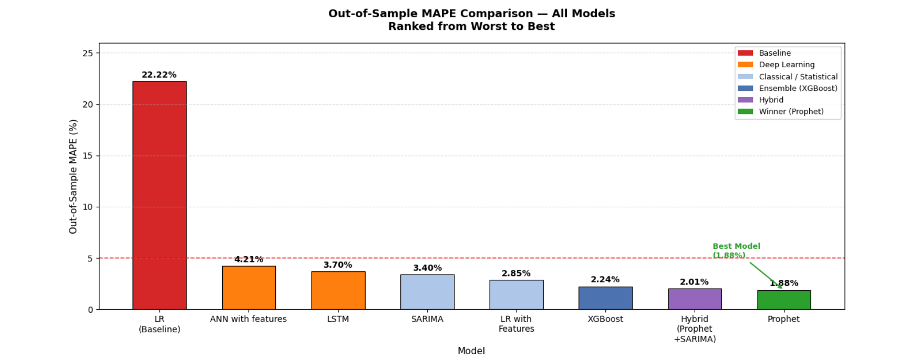

# Monthly CO₂ Emissions Forecasting for Thailand
# Best Result

**Prophet achieved the best out-of-sample performance with a MAPE of 1.88%.**



 # Project Overview

This project presents a comparative evaluation of machine learning, deep learning, classical time-series, and hybrid forecasting approaches for predicting monthly CO₂ emissions in Thailand.
The study uses **471 monthly observations from 1987–2026** and evaluates different forecasting methodologies to identify the most accurate and robust approach for a relatively small, seasonally structured dataset.
The models range from a baseline Linear Regression model to advanced approaches including ANN, LSTM, SARIMA, XGBoost, Prophet, and hybrid forecasting architectures.

 # Objective

The primary objective of this project is to:

* Analyze the historical pattern of monthly CO₂ emissions in Thailand.
* Compare different forecasting methodologies.
* Evaluate the impact of temporal feature engineering.
* Investigate whether deep learning and hybrid models improve forecasting accuracy.
* Identify the best-performing model using out-of-sample evaluation metrics.

 # Dataset

* Country: Thailand
* Frequency: Monthly
* Period: 1987–2026
* Observations: 471
* Target Variable: Monthly CO₂ emissions

#  Models Evaluated

The study compares multiple forecasting approaches, including:

* Linear Regression
* Feature-engineered Linear Regression
* Artificial Neural Network (ANN)
* Long Short-Term Memory (LSTM)
* SARIMA
* XGBoost
* Prophet
* Prophet + SARIMA Hybrid

# Methodology

The forecasting workflow includes:

1. Data preprocessing and cleaning
2. Exploratory time-series analysis
3. Temporal feature engineering
4. Stationarity testing using **ADF** and **KPSS**
5. Box-Cox transformation
6. ACF/PACF analysis
7. Model development and training
8. Out-of-sample forecasting
9. Model evaluation using **MAPE** and other performance metrics
10. Residual analysis for hybrid model development

# Key Results

The comparison produced several important findings:

| Model / Approach                     |      MAPE |
| ------------------------------------ | --------: |
| Linear Regression                    |      ~22% |
| Feature-engineered Linear Regression |    ~2.85% |
| Prophet                              | **1.88%** |
| Prophet + SARIMA                     |     2.01% |

The results show that temporal feature engineering can substantially improve a simple baseline model.
Deep learning approaches such as ANN and LSTM did not outperform the simpler forecasting methods, indicating that the limited sample size can restrict the effectiveness of high-complexity architectures.
*Prophet achieved the best out-of-sample performance with a MAPE of 1.88%.*

Interestingly, the Prophet + SARIMA hybrid did not improve upon Prophet alone. Residual analysis indicated that Prophet had already captured the meaningful temporal structure, leaving residuals close to white noise and therefore providing limited additional information for SARIMA.

# Conclusion

The study demonstrates that greater model complexity does not necessarily result in better forecasting performance.
For this relatively small and seasonally structured CO₂ emissions dataset, a well-specified additive forecasting model outperformed deep learning and hybrid approaches.

The findings highlight the importance of:

* Appropriate feature engineering
* Time-series diagnostics
* Model simplicity
* Residual analysis
* Out-of-sample evaluation

rather than relying solely on increasingly complex architectures.

# Technologies Used

* Python
* Pandas
* NumPy
* Matplotlib
* Scikit-learn
* Statsmodels
* Prophet
* XGBoost
* TensorFlow / Keras

# Project Structure

```text
├── data/
│   └── co2_monthly_1987_2026_clean.csv
│
├── notebooks/
│   └── CO2_Emission_Forecasting.ipynb
│
├── results/
│   ├── actual_vs_predicted.png
│   ├── model_comparison.png
│   └── forecast.png
│
├── README.md
├── requirements.txt
└── .gitignore
```

# How to Run

# 1. Clone the repository

```bash
git clone <repository-url>
cd A-Comparative-Evaluation-of-Forecasting-Approaches-for-Thailand-s-Monthly-CO-Emissions
```

# 2. Install dependencies

```bash
pip install -r requirements.txt
```

#  3. Run the notebook

Open:

```text
notebooks/CO2_Emission_Forecasting.ipynb
```

and execute the cells sequentially.

# Author

**Manan Tulsyan**

B.Tech Chemical Engineering
Birla Institute of Technology, Mesra

---
 If you find this project useful, feel free to explore the repository and the comparative model analysis.
